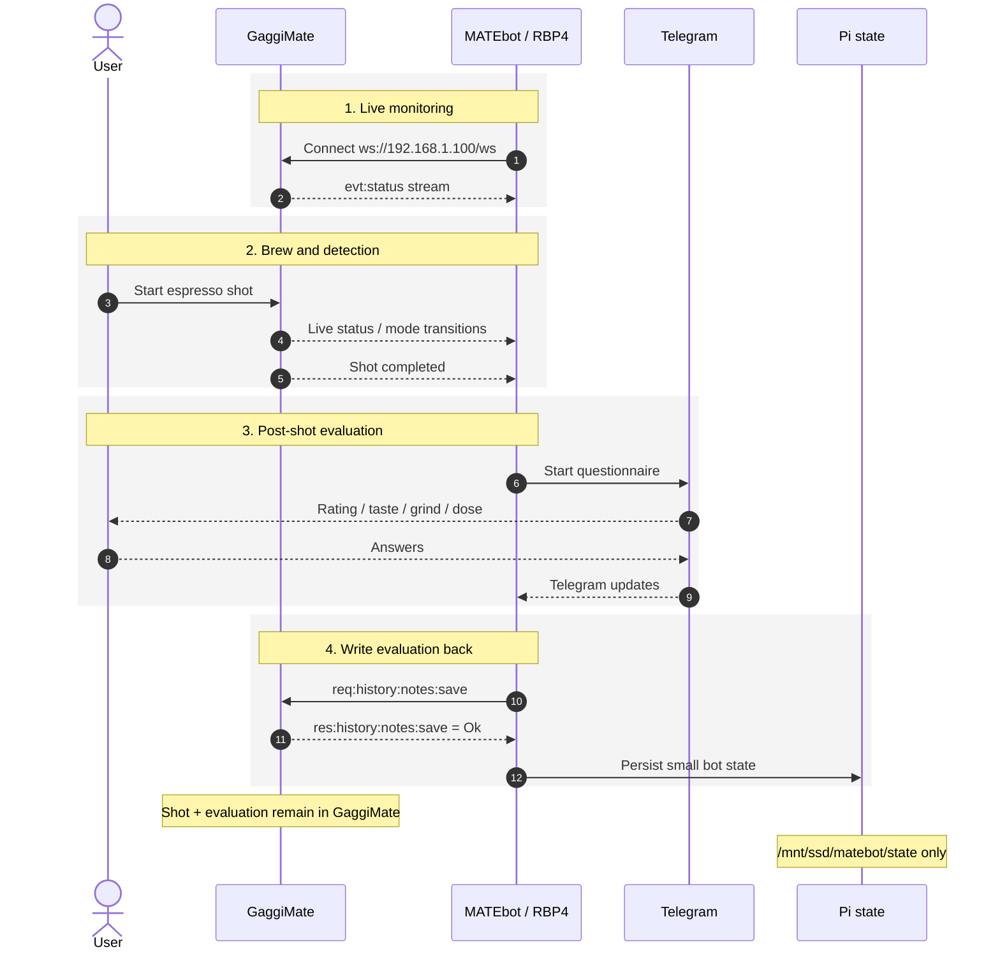

# GaggiMate + MATEbot on RBP4

> **IP address configuration:** `192.168.1.100` is only an example private-LAN address.  
> Before deploying MATEbot, set `MATEBOT_MACHINE_HOST` to the **actual IP address or hostname of your own GaggiMate**.  
> For reliable local operation, use a stable address — preferably a DHCP reservation or static IP.

**Detailed implementation and operations guide**  
**Platform:** Raspberry Pi 4 / Ubuntu / Docker / Portainer / GaggiMate v1.8.1 / MATEbot / Telegram  
**Verified against upstream documentation:** 2026-08-31

> **Current production baseline:** MATEbot watches GaggiMate, starts a Telegram questionnaire after a completed espresso shot, and writes the answers back to **GaggiMate Shot Notes**. The active `12-matebot.yaml` deliberately has **no `MATEBOT_DATA_REPO`**, so there is no automatic shot archive or journal sync to the Raspberry Pi.

---

## Interactive browser configurator

The GitHub Pages `index.html` includes a client-side configuration generator.

It asks only for:

- GaggiMate IP address or hostname;
- timezone;
- MATEbot base directory;
- Telegram secrets directory.

The following values are fixed in generated files:

- UID/GID: `1000:1000`
- minimum shot duration: `10`
- memory limit: `256m`
- CPU limit: `0.50`
- image: `matebot-profile-control:0.4.0-doctor-ready1`, a locally built overlay image (`pull_policy: never`) — must be built before deployment, see §5.1
- dial-in hints: enabled (`MATEBOT_HINTS=1`)
- Diun label: disabled (`diun.enable: "false"`) — Diun cannot check a local custom image for registry updates

The MATEbot upstream defaults are `MATEBOT_HINTS=1` and `MATEBOT_MIN_SHOT_S=10`. The upstream documented Docker image is `ghcr.io/alexnly/matebot:latest`; this deployment builds a local overlay on top of it (§5.1) to add Telegram profile control, `/doctor` diagnostics, and thermal-ready detection.

The generator creates:

- `12-matebot.yaml`
- `portainer.env`
- `prepare-matebot.sh`
- `prepare-matebot-telegram.sh`
- `INSTALL.generated.md`

Files can be downloaded separately or together as `matebot-generated-config.zip`.

The Telegram bot token is **not** requested by the webpage. The generated Telegram script asks for it interactively on the Raspberry Pi with terminal echo disabled.

All generation happens locally in the browser.

---

## 1. Purpose and design principles

The implementation has three primary roles:

1. **GaggiMate** controls and monitors the espresso machine and remains the source of truth for shot history.
2. **MATEbot** runs continuously on RBP4 and watches the GaggiMate WebSocket API.
3. **Telegram** is the interaction layer for post-shot logging and MATEbot commands.

The key design choice is to keep the live workflow simple: **shot data stays on GaggiMate; only MATEbot's small state is persisted on the Pi**.

This avoids coupling the core Telegram workflow to optional archive, Git, site-generation, or `.slog` download operations.

---

## 2. System architecture

```mermaid
flowchart LR
    U[User / Telegram] <-->|Telegram Bot API / HTTPS| MB[MATEbot container on RBP4]
    MB <-->|WebSocket ws://192.168.1.100/ws| GM[GaggiMate display firmware]
    GM <-->|Bluetooth / controller protocol| CTRL[GaggiMate controller board]
    CTRL --> HW[Gaggia espresso machine: heater / pump / valve]
    SCALE[Bluetooth scale] -->|BLE| GM
    MB --> STATE[/Pi SSD: /mnt/ssd/matebot/state]
    SEC[/Dedicated MATEbot Telegram secrets/] -->|read-only bind mounts| MB
```

### Current data paths

| Function | Endpoint / path | Direction |
|---|---|---|
| Live machine connection | `ws://192.168.1.100/ws` | MATEbot → GaggiMate |
| Shot detection | `evt:status` WebSocket events | GaggiMate → MATEbot |
| Save post-shot evaluation | `req:history:notes:save` | MATEbot → GaggiMate |
| Telegram interaction | Telegram Bot API | MATEbot ↔ Telegram |
| Persistent MATEbot state | `/mnt/ssd/matebot/state` | MATEbot → Pi SSD |

The optional archive endpoints (`/api/history/index.bin`, `<id>.slog`, `<id>.json`, `/api/settings`) are part of MATEbot's archive/journal functionality, not the core simple deployment.

---

## 3. How GaggiMate works

GaggiMate upgrades the espresso machine with a dedicated hardware controller and a display-side ESP32 firmware.

Upstream project structure separates:

- **Controller firmware** — low-level heater, pump and valve control plus safety mechanisms.
- **Display firmware** — Wi-Fi, Bluetooth, process orchestration, profiles, plugins, touch UI and local APIs.
- **Web UI** — Preact/Vite interface built into the display firmware.

The display communicates with the controller over Bluetooth and exposes a documented WebSocket API at `/ws` for local integrations such as MATEbot.

### 3.1 Brew profiles

A GaggiMate profile contains one or more phases. Depending on profile type and installed hardware, a phase can use:

- maximum duration,
- pump power / pressure / flow control,
- pressure and flow targets,
- volumetric / weight targets,
- valve state,
- temperature targets or overrides,
- phase transition / stop conditions.

With a supported Bluetooth scale connected, GaggiMate can use measured output weight for volumetric operation.

### 3.2 Shot history and Shot Notes

GaggiMate maintains its own shot history. Shot Notes support fields including:

- rating,
- dose in,
- dose out,
- ratio,
- grind setting,
- taste balance (`sour`, `balanced`, `bitter`),
- free-form notes.

MATEbot's post-shot questionnaire writes into this native Shot Notes structure, so the evaluation remains visible in the GaggiMate UI even if MATEbot is later removed.

### 3.3 Firmware level

The installation uses **GaggiMate v1.8.1**. The upstream v1.8.1 release includes reconnection/crash-related fixes. MATEbot documents GaggiMate firmware **v1.7 or newer** for its binary shot-log functionality.

---

## 4. How MATEbot works

MATEbot is a self-hosted GaggiMate companion. Upstream describes its central workflow as: detect a finished shot, ask the questions the user would otherwise forget, then save those answers directly back into GaggiMate.

### 4.1 Active post-shot flow

1. MATEbot starts in Docker on the Pi.
2. It connects to `ws://192.168.1.100/ws`.
3. It listens to GaggiMate `evt:status` events.
4. It detects a finished brew shot.
5. Short shots and cleaning-style profiles are filtered.
6. It sends a short questionnaire via Telegram.
7. The user provides rating/taste/recipe details.
8. MATEbot sends `req:history:notes:save` to GaggiMate.
9. GaggiMate stores the answer next to the shot in its own history.
10. MATEbot persists only defaults/resume information in its state directory.

### 4.2 Filtering

Current minimum duration:

```env
MATEBOT_MIN_SHOT_S=10
```

MATEbot's documented default cleaning-profile filter is configurable via:

```env
MATEBOT_IGNORE_PROFILES=(?i)backflush|descale|flush|clean
```

### 4.3 Dial-in hints

With:

```env
MATEBOT_HINTS=1
```

MATEbot can suggest a next dial-in change after a sour, bitter or low-rated shot. The documented strategy is to change one variable at a time, following:

1. grind,
2. ratio,
3. temperature.

### 4.4 Thermal ready detection

The deployed image is built from `matebot_extension/matebot-doctor-ready-exact/package/`, which replaces the naive "current temperature ≈ target" ready check with a warm-up state machine driven by the same `evt:status` fields:

```text
IDLE -> HEATING -> OVERSHOOT -> SETTLING -> READY
```

This machine's boiler overshoots the target during startup warm-up before settling back down, so the `/wake` ready notification now waits for an observed overshoot (peak ≥ target + 3.0 °C) followed by ≥20 continuous seconds inside `target ± 0.7 °C`, rather than firing as soon as the target is first crossed. `/status` and `/doctor` both surface the current thermal state; see `matebot_extension/matebot-doctor-ready-exact/package/DOCTOR_READY.md` for the full state diagram, thresholds and example Telegram output. This tracker is read-only — it never changes PID values, profile temperature, mode, or brew parameters.

### 4.5 Telegram commands

| Command | Function |
|---|---|
| `/wake` | Put the machine into brew mode; can optionally invoke a smart-plug hook; ready notification now gated on thermal-ready detection (§4.4) |
| `/sleep` | Return to standby; can optionally invoke a power-off hook |
| `/status` | Show mode, boiler temperature, water level and thermal warm-up state |
| `/last` | Show the last MATEbot-logged shot |
| `/fix` | Redo the questionnaire for the last logged shot |
| `/profile` | Show the currently selected GaggiMate profile |
| `/profiles` | Browse favorite, non-utility profiles; `/profiles all` lists all non-utility profiles |
| `/doctor` | Run read-only diagnostics (state, live status, thermal state, profile API, history) |
| `/help` | List available commands |

Profile selection and diagnostics are implemented by `matebot_extension/matebot-doctor-ready-exact/package/src/matebot/profiles.py` and `diagnostics.py` respectively; see that package's `README.md`/`DOCTOR.md` for exact Telegram wording and safety invariants (e.g. utility/maintenance profiles are hidden and profile changes are blocked while a brew is active).

---

## 5. RBP4 / Docker / Portainer implementation

### 5.1 Active stack

The current stable stack is:

```text
12-matebot.yaml
```

Its main properties:

- image: `matebot-profile-control:0.4.0-doctor-ready1`, a **locally built custom image** (`pull_policy: never`) — see "Build the image" below
- multi-arch base image supports ARM64 / Raspberry Pi
- restart policy: `unless-stopped`
- no public/container service port required for normal Telegram operation
- GaggiMate host: `192.168.1.100`
- only MATEbot state is persisted
- Telegram secrets are mounted read-only
- **no `MATEBOT_DATA_REPO`**
- no journal sync
- no `.slog` archive to Pi
- no JSON sidecar

#### Build the image

`12-matebot.yaml` uses `pull_policy: never`, so the image must already exist on the Docker host before deploying. Build it from the overlay package in this repo:

```bash
cd matebot_extension/matebot-doctor-ready-exact/package
docker build -f Dockerfile.profile-control -t matebot-profile-control:0.4.0-doctor-ready1 .
```

This starts `FROM ghcr.io/alexnly/matebot:latest`, verifies the installed `matebot` version is exactly `0.4.0`, and overlays the Telegram profile control, `/doctor`, and thermal-ready patches described in §4.4/§4.5. See `matebot_extension/matebot-doctor-ready-exact/package/README.md` for the smoke-test command and `CLAUDE.md` for the overlay's internal architecture.

Core environment:

```yaml
environment:
  TZ: ${TZ:-Europe/Budapest}
  MATEBOT_MACHINE_HOST: ${MATEBOT_MACHINE_HOST:-192.168.1.100}  # EXAMPLE ONLY - replace with your GaggiMate IP
  MATEBOT_MESSENGER: telegram
  MATEBOT_STATE_DIR: /data/state
  MATEBOT_HINTS: ${MATEBOT_HINTS:-1}
  MATEBOT_MIN_SHOT_S: ${MATEBOT_MIN_SHOT_S:-10}
  MATEBOT_IGNORE_PROFILES: ${MATEBOT_IGNORE_PROFILES:-(?i)backflush|descale|flush|clean}
```

Persistent volume:

```yaml
volumes:
  - ${MATEBOT_DATA_PATH:-/mnt/ssd/matebot}/state:/data/state
```

### 5.2 Resource limits

The stack currently limits the service to:

| Resource | Value |
|---|---:|
| Memory limit | `256m` |
| Memory reservation | `64m` |
| CPU limit | `0.50` |
| PID limit | `256` |
| Stop grace | `30s` |
| Docker log max size | `5m` |
| Docker log files | `3` |

The service also uses:

```yaml
security_opt:
  - no-new-privileges:true
```

---

## 6. Telegram secret implementation

The real Telegram token is deliberately **not** stored in `portainer.env.example` or hard-coded into the Portainer YAML.

The MATEbot stack uses its own dedicated Telegram secret files (not shared with Diun's update-notification secrets):

```text
/mnt/ssd/secrets/telegram_token
/mnt/ssd/secrets/telegram_chat_id
```

The stack mounts them read-only:

```yaml
- ${MATEBOT_TELEGRAM_TOKEN_PATH}:/run/secrets/telegram_token:ro
- ${MATEBOT_TELEGRAM_CHAT_ID_PATH}:/run/secrets/telegram_chat_id:ro
```

`telegram_chat_id` holds a single plain numeric chat ID (optionally negative for group chats) — not a JSON array. The container startup command reads it directly and validates it before starting MATEbot:

```sh
export TELEGRAM_BOT_TOKEN="$(cat /run/secrets/telegram_token)"
export TELEGRAM_CHAT_ID="$(cat /run/secrets/telegram_chat_id)"

test -n "$TELEGRAM_BOT_TOKEN"

case "$TELEGRAM_CHAT_ID" in
  ''|*[!0-9-]*)
    echo "ERROR: TELEGRAM_CHAT_ID must contain one numeric Telegram chat ID" >&2
    exit 1
    ;;
esac

exec matebot run
```

### 6.1 File permissions

The MATEbot image runs as:

```text
uid=1000(matebot) gid=1000(matebot)
```

Therefore the shared secret directory needs execute/traverse permission for group 1000 and the files need group-read permission.

Recommended effective permissions:

| Path | Owner | Group | Mode |
|---|---|---:|---:|
| `/mnt/ssd/secrets` | root | 1000 | `750` |
| `telegram_token` | root | 1000 | `640` |
| `telegram_chat_id` | root | 1000 | `640` |

Commands:

```bash
sudo chown root:1000 /mnt/ssd/secrets
sudo chmod 750 /mnt/ssd/secrets

sudo chown root:1000 /mnt/ssd/secrets/telegram_token
sudo chown root:1000 /mnt/ssd/secrets/telegram_chat_id
sudo chmod 640 /mnt/ssd/secrets/telegram_token
sudo chmod 640 /mnt/ssd/secrets/telegram_chat_id
```

> **Security:** never publish the actual Telegram bot token in GitHub, screenshots, logs, Markdown or HTML.

---

## 7. Persistent state on the Pi

The active simple stack requires only:

```text
/mnt/ssd/matebot/state
```

which is mounted inside the container as:

```text
/data/state
```

`MATEBOT_STATE_DIR` stores bot defaults and resume state.

A minimal preparation script for the active design is therefore:

```sh
#!/bin/sh
set -eu

MATEBOT_DIR="${1:-/mnt/ssd/matebot}"
PUID="${PUID:-1000}"
PGID="${PGID:-1000}"
STATE_DIR="$MATEBOT_DIR/state"

sudo install -d -m 755 -o "$PUID" -g "$PGID" "$MATEBOT_DIR"
sudo install -d -m 755 -o "$PUID" -g "$PGID" "$STATE_DIR"
```

`prepare-matebot.sh` only creates the `state/` directory shown above — it does not create `shots/`/`json/` archive directories or a Git repository. Those elements belong to the optional archive/JSON implementation described in §13 and would need to be added separately; they are **not required** for `12-matebot.yaml`.

---

## 8. Shared Portainer environment file

The active simple stack uses these values:

```env
MATEBOT_DATA_PATH=/mnt/ssd/matebot
MATEBOT_MACHINE_HOST=192.168.1.100  # EXAMPLE ONLY - replace with your GaggiMate IP
MATEBOT_HINTS=1
MATEBOT_MIN_SHOT_S=10
MATEBOT_MEM_LIMIT=256m
MATEBOT_CPU_LIMIT=0.50
```

The current shared `portainer.env.example` additionally contains:

```env
MATEBOT_DATA_REPO=/data/shots
MATEBOT_JSON_DIR=/data/json
MATEBOT_JSON_SCAN_INTERVAL=10
MATEBOT_JSON_MEM_LIMIT=128m
MATEBOT_JSON_CPU_LIMIT=0.25
```

These values are currently **inert**, because `12-matebot.yaml` does not reference them.

For clarity, there are two reasonable choices:

- keep them in the common env as prepared future options; or
- remove them from production env to make it explicit that archive/JSON export is disabled.

---

## 9. End-to-end shot sequence



**Production baseline:** there is no `MATEBOT_DATA_REPO`, therefore no automatic `.slog` archive or journal sync to RBP4.


---

## 10. Shot IDs and history index

A startup log such as:

```text
INFO matebot.watcher: starting after shot id 146
```

means MATEbot establishes a watcher baseline and processes subsequent completed shots rather than re-running the questionnaire for older history entries.

When investigating shot IDs, an HTTP `200` response for a guessed `/api/history/<id>.json` URL is **not sufficient proof** that the requested ID is a real active shot.

The separate supplied utility `gaggimate_shots_to_json.py` uses the more reliable binary history index:

```text
GET /api/history/index.bin
```

It parses:

- index `entry_count`,
- index `next_id`,
- actual shot IDs,
- `completed` flag,
- `deleted` flag,
- `has_notes` flag.

This is important because **`next_id` and the latest active shot ID are different concepts**.

---

## 11. Operations

### Check container

```bash
docker ps --filter name=matebot
```

### Follow logs

```bash
docker logs -f matebot
```

Healthy startup normally contains messages equivalent to:

```text
telegram messenger polling as chat ...
matebot.watcher: starting after shot id ...
matebot.machine: connected to ws://192.168.1.100/ws
```

### Check image user

```bash
docker run --rm --entrypoint id matebot-profile-control:0.4.0-doctor-ready1
```

Expected:

```text
uid=1000(matebot) gid=1000(matebot)
```

### Inspect state files

```bash
find /mnt/ssd/matebot/state -maxdepth 2 -type f -print
```

### Test GaggiMate reachability

```bash
ping 192.168.1.100
curl -I http://192.168.1.100/
```

### Restart MATEbot

```bash
docker restart matebot
```

---

## 12. Troubleshooting notes from this implementation

### 12.1 Empty or non-numeric Telegram chat ID

Symptom:

```text
ERROR: TELEGRAM_CHAT_ID must contain one numeric Telegram chat ID
```

Meaning: `/run/secrets/telegram_chat_id` was empty, missing, or not a plain (optionally negative) numeric value.

Current solution: the container's entrypoint validates `TELEGRAM_CHAT_ID` with a shell `case` statement and refuses to start MATEbot until `prepare-matebot-telegram.sh` has written a valid numeric value to that file.

### 12.2 Secret permission denied

Symptom:

```text
cat: /run/secrets/telegram_token: Permission denied
PermissionError: /run/secrets/telegram_chat_id
```

Cause: original `root:root 700/600` permissions did not allow the MATEbot UID/GID 1000 process to traverse/read the files.

Solution: group `1000`, directory `750`, files `640`.

### 12.3 `The machine went offline before the journal could sync`

This was observed when `MATEBOT_DATA_REPO` archive/journal sync was enabled.

The current production design avoids that code path completely by using `12-matebot.yaml`, which has no `MATEBOT_DATA_REPO`.

### 12.4 Unexpected machine restart/offline event

If the GaggiMate resets during an integration action:

1. leave archive disabled;
2. reproduce using only Telegram + Shot Notes;
3. run `docker logs -f matebot`;
4. monitor `ping 192.168.1.100` in parallel;
5. if reproducible, capture GaggiMate support/coredump data and isolate the API action immediately before the reset.

---

## 13. Optional MATEbot features not enabled in the production baseline

### 13.1 Local shot archive + static journal

Setting `MATEBOT_DATA_REPO` to a Git working tree enables archive/journal functionality.

Upstream MATEbot can archive:

- `.slog` shot logs,
- Shot Notes,
- brew profiles,
- machine settings with credentials redacted,
- generated static journal pages.

It can then publish `/docs` via GitHub Pages.

**Current decision:** disabled for the live workflow.

### 13.2 `.slog` decoder

MATEbot includes:

```bash
matebot decode SHOT.slog
```

which outputs JSON. CSV is available with:

```bash
matebot decode SHOT.slog --csv
```

### 13.3 Separate history export utility

The supplied `gaggimate_shots_to_json.py` is useful as an **offline/on-demand** tool instead of tying exports to every Telegram questionnaire.

It:

- reads `index.bin`,
- downloads indexed `.slog` files,
- decodes GaggiMate v5 logs,
- optionally fetches per-shot notes,
- creates one JSON file per shot.

This is a good isolation pattern: the live MATEbot remains simple while historical analysis is performed independently.

### 13.4 Smart-plug cold start

MATEbot supports:

```text
MATEBOT_WAKE_HOOK
MATEBOT_SLEEP_HOOK
```

These can run arbitrary local commands, including Home Assistant webhook calls, Tasmota, Shelly or other smart-home control commands.

### 13.5 Camera and shot reels

With `MATEBOT_CAMERA=1`, MATEbot can serve a phone-camera page and synchronize video with shot charts. Browsers require HTTPS for camera access, so this feature would need TLS/WebSocket proxying (for example through the existing Nginx Proxy Manager).

---

## 14. Security model

Current security properties:

- GaggiMate ↔ MATEbot communication stays on the local LAN.
- Telegram communication necessarily reaches the Telegram Bot API.
- Bot token is stored in a host secret file, not YAML/env.
- Secret mounts are read-only.
- MATEbot runs as UID/GID 1000.
- `no-new-privileges:true` is enabled.
- no MATEbot web port is exposed in the simple deployment.
- shot archive and settings backup are disabled in the live workflow.

### Never commit to GitHub

- Telegram bot token,
- private keys,
- Home Assistant tokens,
- Wi-Fi credentials,
- passwords,
- raw secret files.

---

## 15. GitHub documentation layout


## 16. Recommended production baseline

```text
GaggiMate v1.8.1
        │
        │ ws://192.168.1.100/ws
        ▼
MATEbot (local overlay image) on Raspberry Pi 4
        │
        ├── Telegram questionnaire
        ├── Shot Notes saved back to GaggiMate
        ├── Thermal-ready detection (HEATING→OVERSHOOT→SETTLING→READY)
        ├── /profile, /profiles, /doctor (read-only diagnostics)
        └── /mnt/ssd/matebot/state only

NO MATEBOT_DATA_REPO
NO automatic live shot archive to Pi
NO JSON sidecar
NO public MATEbot port
```

This minimizes moving parts and keeps the most useful function: **automatic post-shot logging into GaggiMate's native history**.

---

## 17. Implementation files

| File / path | Role |
|---|---|
| `12-matebot.yaml` | Active Portainer stack (local overlay image, `pull_policy: never`) |
| `portainer.env.example` | Shared Portainer variables |
| `prepare-matebot.sh` | Host prep; creates only the `state/` directory required by the active stack |
| `matebot_extension/matebot-doctor-ready-exact/package/` | Source of the deployed overlay image (Dockerfile, patched `matebot` files, profile control/`/doctor`/thermal-ready docs) — see its own `README.md`/`CLAUDE.md` |
| `gaggimate_shots_to_json.py` | Separate on-demand history downloader / v5 decoder |
| `/mnt/ssd/matebot/state` | Active persistent MATEbot state |
| `/mnt/ssd/secrets/telegram_token` | Dedicated MATEbot Telegram token file |
| `/mnt/ssd/secrets/telegram_chat_id` | Dedicated MATEbot Telegram chat-ID file (plain numeric) |

---

## 18. Primary upstream references

### MATEbot

- Repository: [https://github.com/AlexNly/MATEbot](https://github.com/AlexNly/MATEbot)
- Docker image: `ghcr.io/alexnly/matebot:latest`

Key documented interfaces:

- `ws://<machine>/ws`
- `evt:status`
- `req:history:notes:save`
- optional `/api/history/index.bin`, `<id>.slog`, `<id>.json`
- optional `/api/settings`

### GaggiMate

- Repository: [https://github.com/jniebuhr/gaggimate](https://github.com/jniebuhr/gaggimate)
- Documentation: [https://gaggimate.eu/](https://gaggimate.eu/)
- WebSocket API: [https://github.com/jniebuhr/gaggimate/blob/master/docs/websocket-api.yaml](https://github.com/jniebuhr/gaggimate/blob/master/docs/websocket-api.yaml)
- Shot Notes API: [https://github.com/jniebuhr/gaggimate/blob/master/docs/shot-notes-api.md](https://github.com/jniebuhr/gaggimate/blob/master/docs/shot-notes-api.md)
- Profiles guide: [https://github.com/jniebuhr/gaggimate-docs/blob/master/src/pages/docs/profiles.md](https://github.com/jniebuhr/gaggimate-docs/blob/master/src/pages/docs/profiles.md)
- v1.8.1 release: [https://github.com/jniebuhr/gaggimate/releases/tag/v1.8.1](https://github.com/jniebuhr/gaggimate/releases/tag/v1.8.1)
